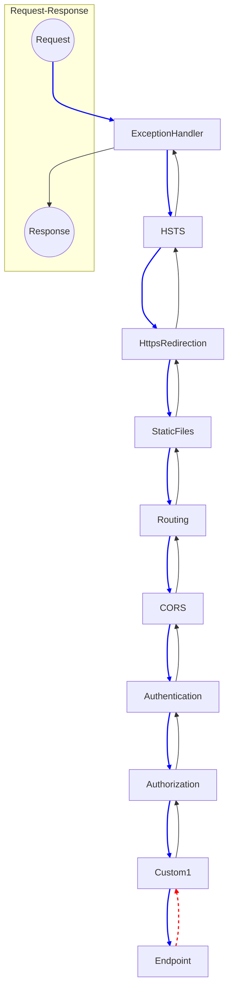

```mermaid
graph TD;
    subgraph Request-Response
        Request((Request))
        Response((Response))
    end
    Request--->ExceptionHandler
    ExceptionHandler--->HSTS
    HSTS--->HttpsRedirection
    HttpsRedirection--->StaticFiles
    StaticFiles--->Routing
    Routing--->CORS
    CORS--->Authentication
    Authentication--->Authorization
    Authorization--->Custom1
    Custom1--->Endpoint
    
    Endpoint--->Custom1
    Custom1--->Authorization
    Authorization--->Authentication
    Authentication--->CORS
    CORS--->Routing
    Routing--->StaticFiles
    StaticFiles--->HttpsRedirection
    HttpsRedirection--->HSTS
    HSTS--->ExceptionHandler
    ExceptionHandler--->Response
    
    %% Link Styles
    linkStyle 0 stroke-width:2px,fill:none,stroke:blue;
    linkStyle 1 stroke-width:2px,fill:none,stroke:blue;
    linkStyle 2 stroke-width:2px,fill:none,stroke:blue;
    linkStyle 3 stroke-width:2px,fill:none,stroke:blue;
    linkStyle 4 stroke-width:2px,fill:none,stroke:blue;
    linkStyle 5 stroke-width:2px,fill:none,stroke:blue;
    linkStyle 6 stroke-width:2px,fill:none,stroke:blue;
    linkStyle 7 stroke-width:2px,fill:none,stroke:blue;
    linkStyle 8 stroke-width:2px,fill:none,stroke:blue;
    linkStyle 9 stroke-width:2px,fill:none,stroke:blue;
    linkStyle 10 stroke-dasharray: 5 5, stroke-width:2px,fill:none,stroke:red;

```

