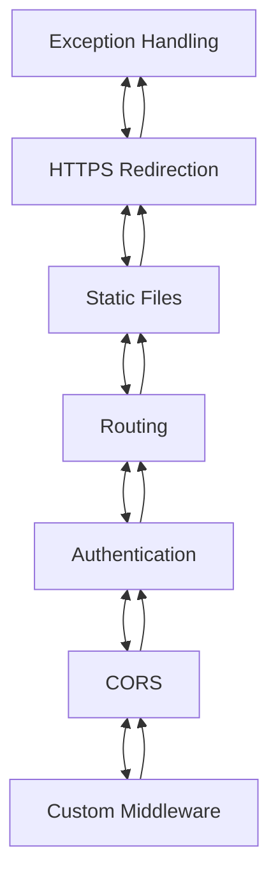

```mermaid
graph TD;
    A[Exception Handling] <-->| | B[HTTPS Redirection];
    B <--> C[Static Files];
    C <--> D[Routing];
    D <--> E[Authentication];
    E <--> F[CORS];
    F <--> G[Custom Middleware];
    
    
    C --> B;
    D --> C;
    E --> D;
    F --> E;
    G --> F;
    B --> A;


```
