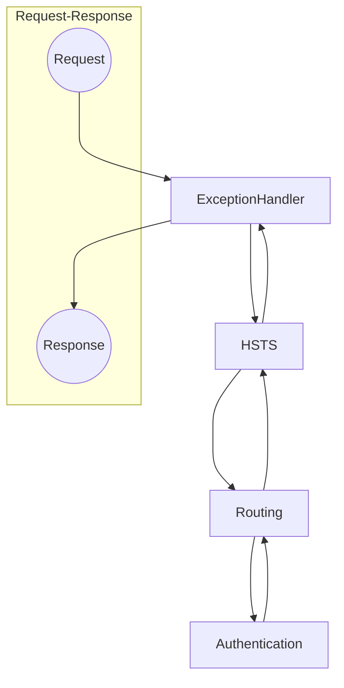

```mermaid
graph TD;
    subgraph Request-Response
        Request((Request))
        Response((Response))
    end
    Request--->ExceptionHandler
    ExceptionHandler--->HSTS
    HSTS--->Routing
    Routing--->Authentication
    Authentication--->Routing
    Routing--->HSTS
    HSTS--->ExceptionHandler
    ExceptionHandler--->Response

```
