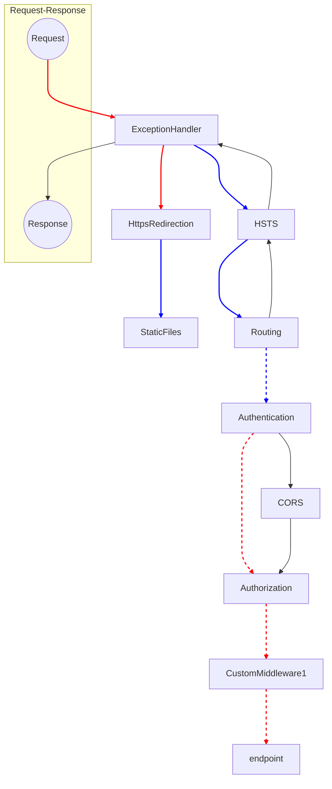

```mermaid
graph TD;
    subgraph Request-Response
        Request((Request))
        Response((Response))
    end
    Request--->ExceptionHandler
    ExceptionHandler--->HttpsRedirection
    HttpsRedirection--->StaticFiles
    ExceptionHandler--->HSTS
    HSTS--->Routing
    Routing--->Authentication
    Authentication--->Authorization
    Authorization--->CustomMiddleware1
    CustomMiddleware1--->endpoint
    Routing--->HSTS
    HSTS--->ExceptionHandler
    ExceptionHandler--->Response
    Authentication--->CORS
    CORS--->Authorization

    linkStyle 0 stroke-width:2px,fill:none,stroke:red;
    linkStyle 1 stroke-width:2px,fill:none,stroke:red;
    linkStyle 2 stroke-width:2px,fill:none,stroke:blue;
    linkStyle 3 stroke-width:2px,fill:none,stroke:blue;
    linkStyle 4 stroke-width:2px,fill:none,stroke:blue;
    linkStyle 5 stroke-dasharray: 5 5, stroke-width:2px,fill:none,stroke:blue;
    linkStyle 6 stroke-dasharray: 5 5, stroke-width:2px,fill:none,stroke:red;
    linkStyle 7 stroke-dasharray: 5 5, stroke-width:2px,fill:none,stroke:red;
    linkStyle 8 stroke-dasharray: 5 5, stroke-width:2px,fill:none,stroke:red;

```
