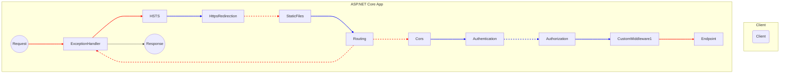

```mermaid
graph TD;
    subgraph Client
        c(Client)
    end
    subgraph ASP.NET Core App
        Request((Request))
        Response((Response))
        Request--->ExceptionHandler
        ExceptionHandler--->HSTS
        HSTS--->HttpsRedirection
        HttpsRedirection--->StaticFiles
        StaticFiles--->Routing
        Routing--->Cors
        Cors--->Authentication
        Authentication--->Authorization
        Authorization--->CustomMiddleware1
        CustomMiddleware1--->Endpoint
        Routing--->ExceptionHandler
        ExceptionHandler--->Response
    end

    linkStyle 0 stroke-width:2px,fill:none,stroke:red;
    linkStyle 1 stroke-width:2px,fill:none,stroke:red;
    linkStyle 2 stroke-width:2px,fill:none,stroke:blue;
    linkStyle 3 stroke-dasharray: 5 5, stroke-width:2px,fill:none,stroke:red;
    linkStyle 4 stroke-width:2px,fill:none,stroke:blue;
    linkStyle 5 stroke-dasharray: 5 5, stroke-width:2px,fill:none,stroke:red;
    linkStyle 6 stroke-width:2px,fill:none,stroke:blue;
    linkStyle 7 stroke-dasharray: 5 5, stroke-width:2px,fill:none,stroke:blue;
    linkStyle 8 stroke-width:2px,fill:none,stroke:blue;
    linkStyle 9 stroke-width:2px,fill:none,stroke:red;
    linkStyle 10 stroke-dasharray: 5 5, stroke-width:2px,fill:none,stroke:red;


```
