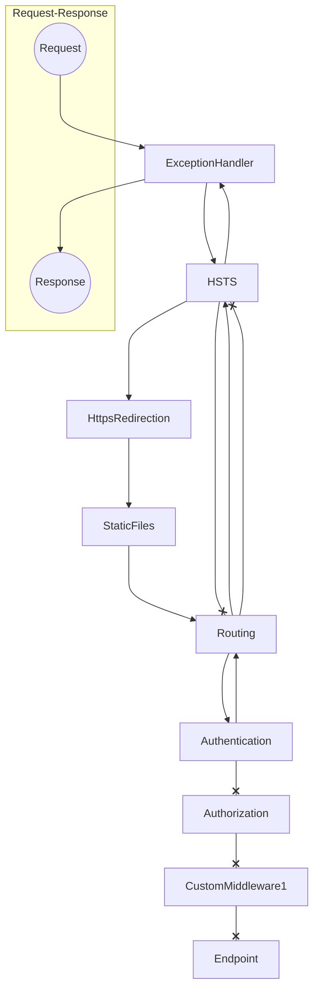

```mermaid
graph TD;
    subgraph Request-Response
        Request((Request))
        Response((Response))
    end
    Request--->ExceptionHandler
    ExceptionHandler--->HSTS
    HSTS--->HttpsRedirection
    HttpsRedirection--->StaticFiles
    StaticFiles--->Routing
    Routing--->Authentication
    Authentication--->Routing
    Routing--->HSTS
    HSTS--->ExceptionHandler
    ExceptionHandler--->Response

    HSTS--xRouting
    Routing--xHSTS
    Authentication--xAuthorization
    Authorization--xCustomMiddleware1
    CustomMiddleware1--xEndpoint

```
