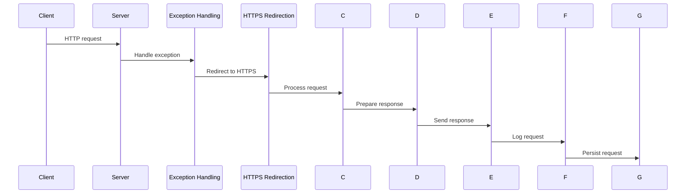

```mermaid
sequenceDiagram
  participant Client
  participant Server
  Client ->> Server: HTTP request
  Server ->> Exception Handling: Handle exception
  Exception Handling ->> HTTPS Redirection: Redirect to HTTPS
  HTTPS Redirection ->> C: Process request
  C ->> D: Prepare response
  D ->> E: Send response
  E ->> F: Log request
  F ->> G: Persist request

```